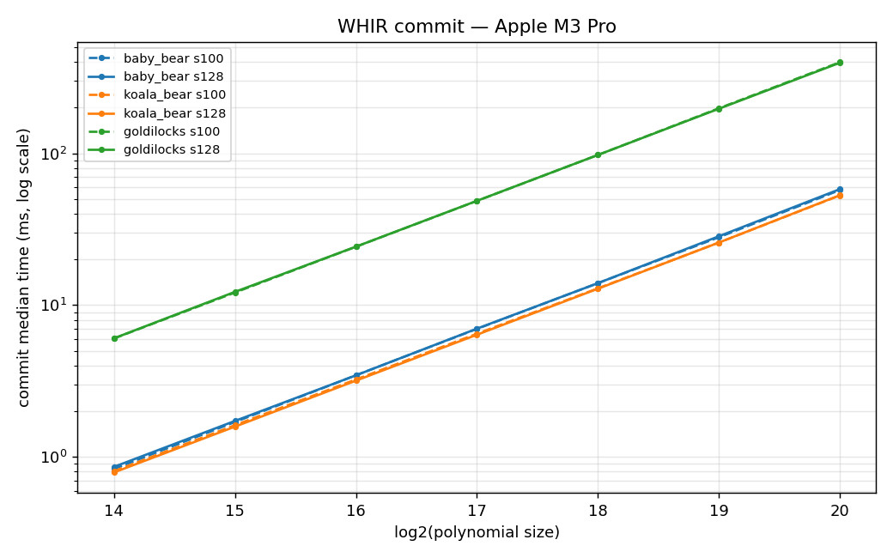
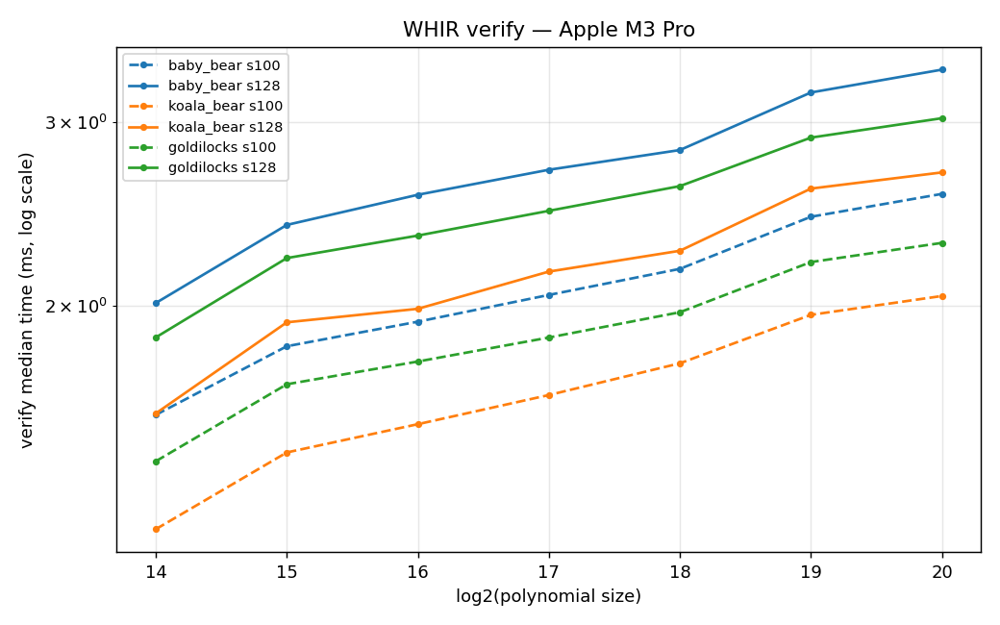
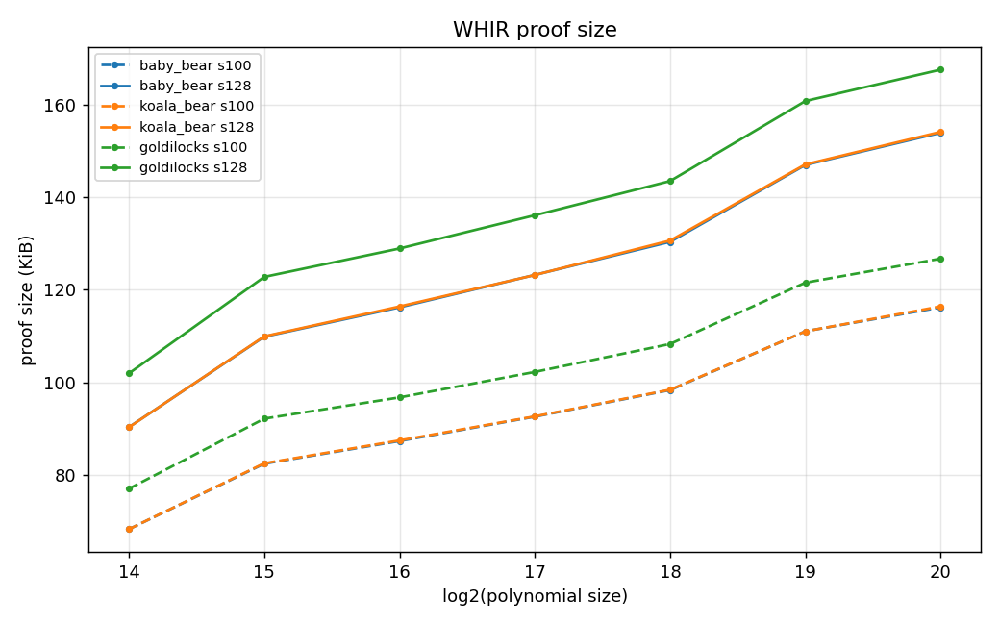
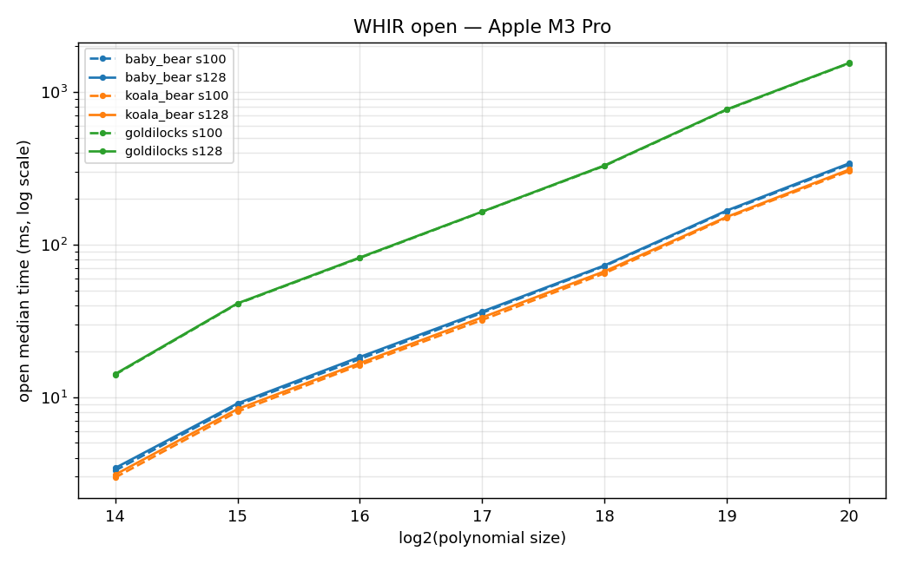

# WHIR PCS — cross-field benchmark report

**Run:** 2^14–2^20 complete (126 timed cells). 2^21–2^24 optional (heavy; see end).
**Date:** 2026-05-31. **Base commit:** `8fa63378`. **Bench:** `whir/benches/whir_fields.rs` (this branch).
**Machine:** Apple M3 Pro (numbers are machine-specific — re-run to compare).

> **Note on `open`.** `open` _with_ proof-of-work is dominated by the grind — a ~19-bit PoW search
> whose realized cost is a geometric draw worth ~0.1–0.5 s with ±100% variance, so the raw `open`
> column is a PoW lottery, not a scaling curve (reproduced identically across two runs; not a
> measurement bug). The **`open` table below uses `pow_bits=0`** (grinding disabled, WHIR compensates
> with more queries) to isolate clean prover _arithmetic_. `commit`, `verify`, `proof size` are at the
> real `pow=20` config.

## Environment

- Apple **M3 Pro**, 12 cores, 18 GB RAM, macOS 26.5
- rustc 1.92.0, `cargo bench` (release). `target-cpu=native` **not** set.
- Criterion medians (10–20 samples). Proof size = `postcard`-serialized proof.

## Configuration

WHIR PCS (`p3-whir`, Radix-2 multilinear), single polynomial of `2^n` base-field coefficients, one opening.
Operations timed **separately**. WHIR params constant across fields: **folding=4, starting rate 1,
CapacityBound, pow cap 20**. Security swept at **100 and 128 bits** (extension held constant per field).

| Field      | Extension |  EF size |   Base | Merkle hash                      | Packing |
| ---------- | --------- | -------: | -----: | -------------------------------- | ------- |
| BabyBear   | deg-8     | ~248 bit | 31 bit | Poseidon2 w16/w24, 8-elem digest | SIMD    |
| KoalaBear  | deg-8     | ~248 bit | 31 bit | Poseidon2 w16/w24, 8-elem digest | SIMD    |
| Goldilocks | deg-5     | ~320 bit | 64 bit | Poseidon2 w8, 4-elem digest      | SIMD    |

### Why deg-8 / deg-5 (and the cost it implies)

Committed _data_ is base-field, but WHIR folds with `f_even + α·f_odd`, `α ∈ EF`, so from round 1 the
folded codeword and sumcheck arithmetic live in `EF`. Hence **commit is extension-independent; open/verify
scale with extension degree.** A 128-bit config needs `|EF|` large enough that the folding proximity-gap
error (`~poly(domain,list)/|EF|`) is bridged by a _feasible_ grind (≤~20 bits). BabyBear deg-4 (124-bit)
would need a 55-bit grind (infeasible); deg-8 (248-bit) needs ~19. **KoalaBear has no deg-5/6** — its
`p−1 = 2²⁴·127` admits binomial extensions only of degree `2ᵃ·127ᵇ` (number theory: `Xᵈ−W` is irreducible
only if every prime factor of `d` divides `p−1`) — so deg-8 is forced; used for BabyBear too for an
equal-extension comparison. Goldilocks deg-5 (320-bit) is its smallest ≥128-bit binomial extension.

### Fields excluded (architecturally impossible here — not an oversight)

- **BN254** — WHIR's query sampler requires `F: PrimeField64` (uniform bits from a `[u64;64]` rejection
  table). BN254 is 254-bit → cannot implement `PrimeField64` → WHIR-over-BN254 impossible without a new
    > 64-bit sampler in `p3-challenger`. (Barretenberg's PCS is **KZG over BN254** — pairing-based, a
    > different mechanism; no same-field WHIR-vs-KZG comparison is possible.)
- **Mersenne31** — two-adicity 1 (circle field); not `TwoAdicField` over its prime subgroup.

---

## Commit — median time (ms) — TRUSTWORTHY

Security-independent (commits the base-field codeword; no queries/grind). Values shown are s100 ≡ s128.

| 2^n | BabyBear | KoalaBear | Goldilocks |
| --: | -------: | --------: | ---------: |
|  14 |     0.88 |      0.80 |       6.08 |
|  15 |     1.75 |      1.59 |      12.20 |
|  16 |     3.52 |      3.21 |      24.47 |
|  17 |     7.07 |      6.46 |      49.00 |
|  18 |    14.17 |     12.98 |      98.51 |
|  19 |    28.66 |     26.22 |     197.27 |
|  20 |    58.39 |     53.60 |     394.66 |

- Clean **~2× per +1 size** (linear in `2^n`), as expected for the LDE + Merkle commit.
- **KoalaBear ~8% faster than BabyBear** throughout.
- **Goldilocks ~7.4× slower** (e.g. 2^20: 395 ms vs 54 ms). It commits a 64-bit field through a w8
  Poseidon2 (4-elem digest) — fewer SIMD lanes and a wider hash per byte than the 31-bit w16/w24 path.
  This is the dominant commit-cost finding: **small 31-bit fields commit far cheaper than Goldilocks.**



## Verify — median time (ms) — TRUSTWORTHY

| 2^n | BB s100 | BB s128 | KB s100 | KB s128 | GL s100 | GL s128 |
| --: | ------: | ------: | ------: | ------: | ------: | ------: |
|  14 |    1.57 |    2.01 |    1.22 |    1.58 |    1.42 |    1.87 |
|  16 |    1.93 |    2.56 |    1.54 |    1.99 |    1.77 |    2.34 |
|  18 |    2.17 |    2.82 |    1.76 |    2.26 |    1.97 |    2.61 |
|  20 |    2.56 |    3.37 |    2.04 |    2.69 |    2.30 |    3.03 |

- Cheap (1.2–3.4 ms) and gently **log-linear** in `n` (verify cost ~ #queries × Merkle-path length).
- **128-bit ≈ +30% over 100-bit** (more queries to check).
- **KoalaBear fastest** to verify; BabyBear slowest; Goldilocks between.



## Proof size (KiB) — TRUSTWORTHY

| 2^n | BB s100 | BB s128 | KB s100 | KB s128 | GL s100 | GL s128 |
| --: | ------: | ------: | ------: | ------: | ------: | ------: |
|  14 |    68.4 |    90.4 |    68.4 |    90.4 |    77.1 |   102.0 |
|  16 |    87.4 |   116.2 |    87.5 |   116.4 |    96.8 |   128.9 |
|  18 |    98.4 |   130.4 |    98.5 |   130.6 |   108.3 |   143.5 |
|  20 |   116.2 |   153.9 |   116.4 |   154.1 |   126.7 |   167.5 |

- **128-bit ≈ +33% proof** vs 100-bit (more STIR queries).
- BabyBear ≈ KoalaBear (identical 248-bit EF). **Goldilocks ~9% larger** (320-bit EF → larger elements).
- Grows sub-2× per size step (query count grows slowly; most growth is Merkle authentication paths).



## Open / Prove — arithmetic (pow_bits=0), median ms

Grinding disabled to isolate prover arithmetic. **Security-independent** (s100 ≈ s128 within ~2%;
without grinding the only difference is a slightly higher query count). s100 shown.

| 2^n | BabyBear | KoalaBear | Goldilocks |
| --: | -------: | --------: | ---------: |
|  14 |      3.3 |       3.0 |       14.0 |
|  15 |      8.9 |       8.0 |       40.8 |
|  16 |     17.7 |      16.2 |       81.5 |
|  17 |     35.6 |      32.0 |      163.3 |
|  18 |     72.1 |      64.7 |      327.1 |
|  19 |    164.5 |     149.3 |      762.9 |
|  20 |    333.8 |     302.5 |     1539.0 |

- Clean **~2× per +1 size** (the FRI/sumcheck folding + Merkle-open prover work).
- **KoalaBear fastest**, BabyBear ~8–10% slower, **Goldilocks ~5× slower** than the 31-bit fields —
  its deg-5/320-bit EF arithmetic over a 64-bit base is the heaviest. Same ordering as commit.



### The grind in real proving (`pow=20`)

The deployed `open` adds the proof-of-work on top of the arithmetic above. Measured `pow=20` `open`
(reproduced, but high-variance) vs the arithmetic floor:

| cell                 | open @pow=20 | open @pow=0 (arith) | ≈ grind |
| -------------------- | -----------: | ------------------: | ------: |
| BabyBear 2^14 s100   |       195 ms |              3.3 ms | ~190 ms |
| BabyBear 2^20 s100   |       418 ms |              334 ms |  ~85 ms |
| Goldilocks 2^20 s128 |      2020 ms |             1547 ms | ~470 ms |

So at small `n`, `open` is ~98% proof-of-work; by 2^20 the arithmetic dominates. The grind is a
**fixed expected cost (~`pow_bits` bits) with large per-transcript variance** — tune `pow_bits` (vs
query count / proof size) to trade prover grind against proof size. **For prover-arithmetic comparison
across fields, use the pow=0 table; for real wall-clock, add the grind.**

## Headline findings (from clean data)

1. **31-bit fields (BabyBear/KoalaBear) dominate commit** — ~7× cheaper than Goldilocks, thanks to
   SIMD-packed w16/w24 Poseidon2. Commit scales cleanly 2× per size and is security-independent.
2. **KoalaBear is the fastest field** across commit, verify, and open (arithmetic) — ~8–10% ahead of
   BabyBear, ~5–7× ahead of Goldilocks.
3. **128-bit costs ~30% verify time and ~33% proof size** over 100-bit; **commit is unaffected**.
4. **The price of 128-bit over small fields is the extension**: deg-8 EF arithmetic makes `open` the
   bottleneck, not commit. A real deployment would use BabyBear **deg-5** (155-bit, ~40% less EF work)
   — KoalaBear cannot (no deg-5/6 exists for it).

## Reproduce

Everything is self-contained: the bench lives at `whir/benches/whir_fields.rs`, the aggregator/plotter
at `.claude/2026-05-31-whir-bench/aggregate.py`.

```bash
# 1. timings (default: log 14..=20, security {100,128}). ~45 min on an M3 Pro.
cargo bench -p p3-whir --bench whir_fields

# 2. proof sizes (writes proof_sizes.csv)
WHIR_BENCH_PROOF_SIZES="$PWD/.claude/2026-05-31-whir-bench/proof_sizes.csv" \
  cargo bench -p p3-whir --bench whir_fields

# 3. clean open arithmetic (disable proof-of-work grinding)
WHIR_BENCH_POW=0 cargo bench -p p3-whir --bench whir_fields -- 'whir_fields/open'

# 4. aggregate criterion JSON + proof CSV -> results.csv + plot_*.png
python3 .claude/2026-05-31-whir-bench/aggregate.py
```

Env knobs (all optional): `WHIR_BENCH_MIN_LOG` / `WHIR_BENCH_MAX_LOG` (size sweep, default 14/20),
`WHIR_BENCH_POW` (PoW bits, default 20; `0` = no grind), `WHIR_BENCH_PROOF_SIZES=<path>` (emit CSV).
`aggregate.py` needs only Python + `matplotlib`.

### Reproduce with Claude Code
Clone the repo, check out this branch, and tell your Claude:

> Run the WHIR cross-field benchmark in `whir/benches/whir_fields.rs` per the Reproduce steps in
> `.claude/2026-05-31-whir-bench/REPORT.md`, then run `aggregate.py` and update the tables/plots in
> the report with my machine's numbers. Run the bench with nothing else CPU-heavy in parallel
> (concurrent load corrupts `open` timings), and use `WHIR_BENCH_POW=0` for the `open` arithmetic table.

## Pending / next (optional)

- **2^21–2^24 extension** — `WHIR_BENCH_MAX_LOG=24 cargo bench -p p3-whir --bench whir_fields`.
  Heavy (deg-8/`pow=20` open ≈ minutes/iter at 2^24) — run overnight, no concurrent load.
- **Smaller extensions** for a true minimal-cost 128-bit config: BabyBear deg-5 (155-bit) and a
  Goldilocks deg-3 (192-bit, needs `BinomiallyExtendable<3>` added to `p3-goldilocks`). Both would
  cut `open`/proof cost vs the deg-8/deg-5 used here; KoalaBear cannot go below deg-8 (`3,5 ∤ p−1`).
